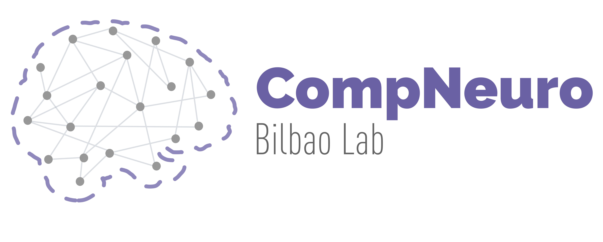

# Devcontainers basic configuration files
This repo conatins the basic devcontainer configuration files for neuroimaging coding in python, used by the Computational Neuroimaging Lab at Biocruces Bizkaia HRI. 

